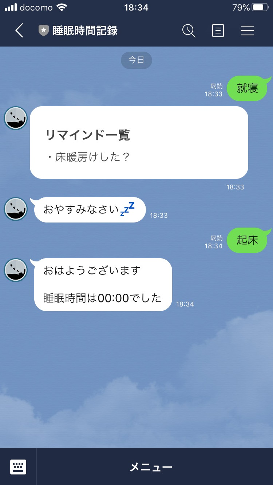
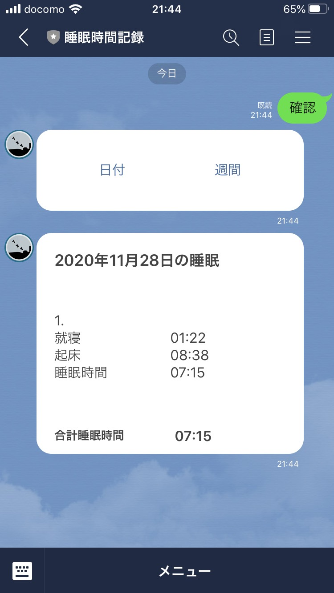
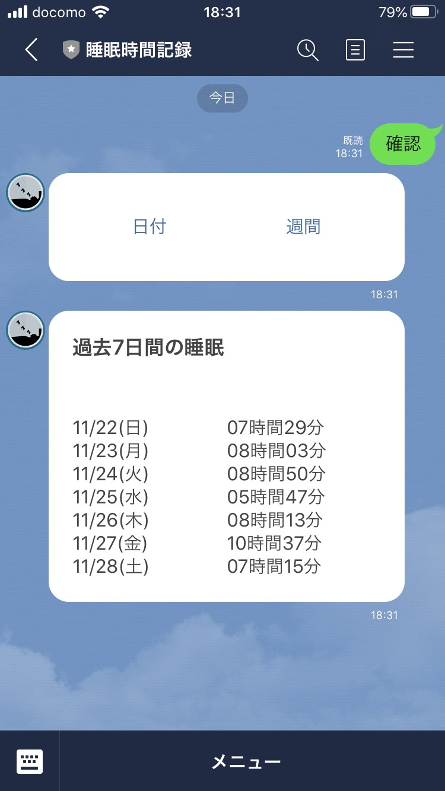
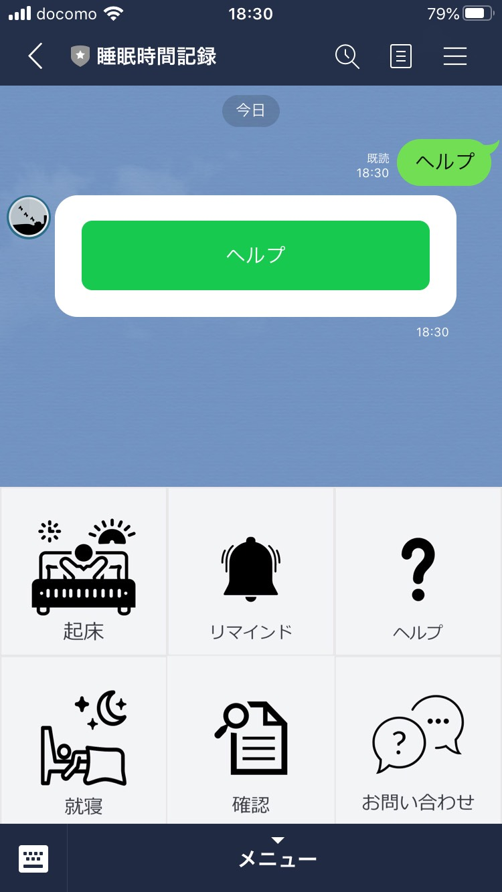
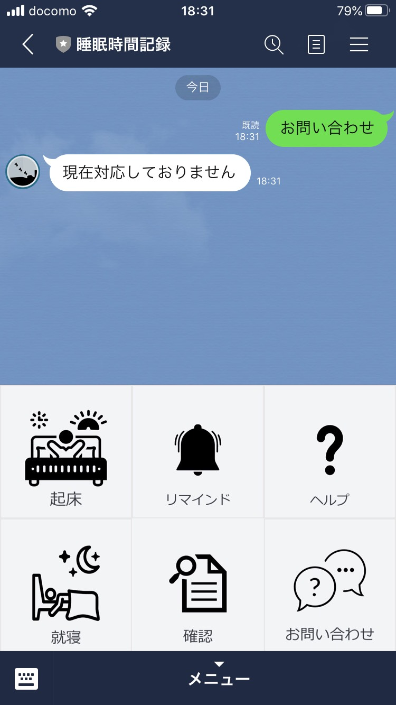
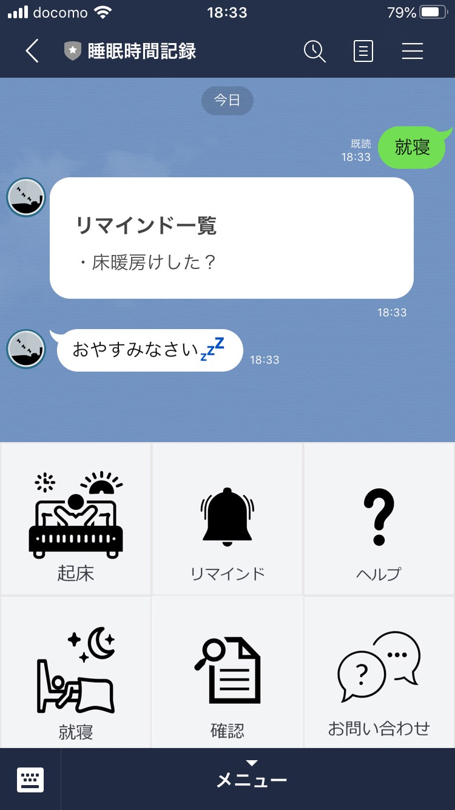
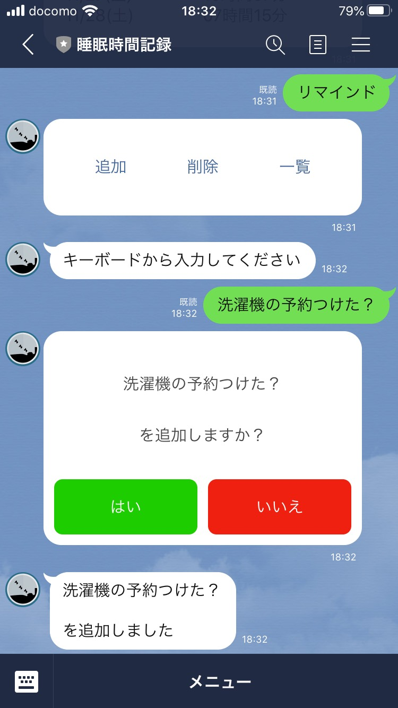
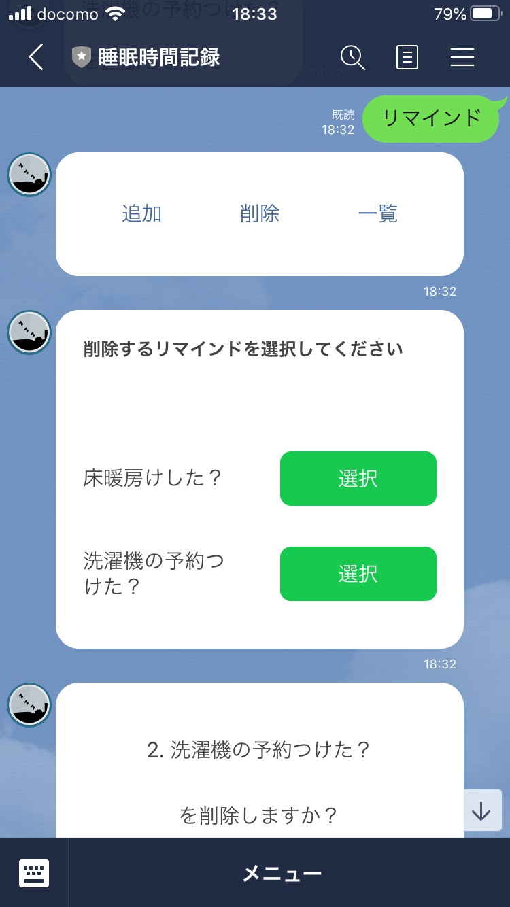
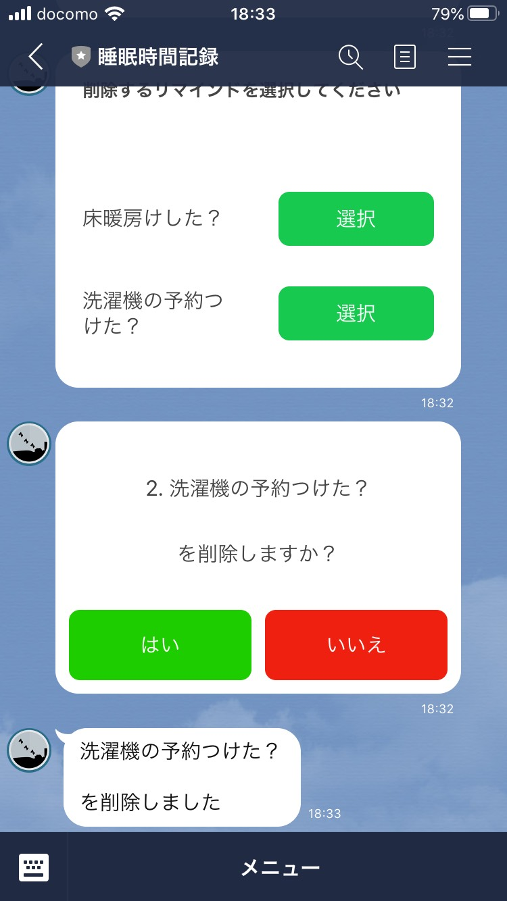

# calculate_sleeping_hours

## 基本機能

- [睡眠時間記録](#睡眠時間記録)
- [睡眠時間確認](#睡眠時間確認)
- [睡眠時間警鐘](#睡眠時間警鐘)
- [ヘルプ](#ヘルプ)
- [お問い合わせ](#お問い合わせ)
- [週間報告](#週間報告)

## オプション機能

- [就寝前リマインド](#就寝前リマインド)

### 睡眠時間記録

`就寝`を選択すると、睡眠時間の記録が開始されます。`起床`を選択したとき、睡眠時間を計算し、Google Spread Sheet に記録します。

`起床`を選択したとき、睡眠時間を報告してくれます。

※`就寝-起床`は何回でも記録できます。

### 睡眠時間確認

`確認 日付`を選択すると、指定された日の睡眠時間を教えてくれます。

`確認 週間`を選択すると、過去 7 日間の睡眠時間を教えてくれます。

### ヘルプ

`ヘルプ`を選択すると、このページのリンクを送信します。

### お問い合わせ

`お問い合わせ`を選択すると、Google Form のリンクを送信します。

※現在はサポートされていません。

### 週間報告

`毎週日曜日の午前9時`に日曜日から土曜日までの睡眠時間を報告してくれます。

### 睡眠時間警鐘

睡眠時間が`3日間`以上続けて`6時間未満`もしくは`9時間以上`の場合、連続している日数とともに警鐘を鳴らしてくれます。

### 就寝前リマインド

リマインドを追加しておくと、`就寝`を選択したときに、寝る前にやっておくことを確認してくれます。

リマインドの追加は以下の通りです。

リマインドの削除は以下の通りです。

 

## 設定方法

現在取り組み中。
